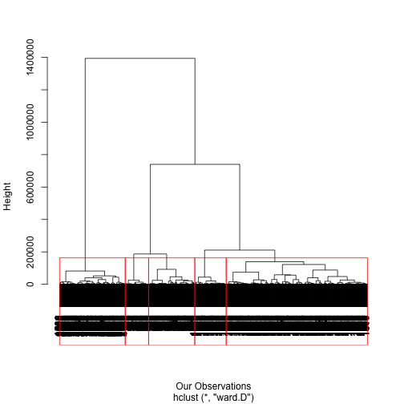

<link rel="stylesheet" href="http://netdna.bootstrapcdn.com/bootstrap/3.0.3/css/bootstrap.min.css">

Customer Segmentation in the Boating Industry
========================================================

**J. Niessing, INSEAD**

**T. Evgeniou, INSEAD**

The Business Issue
---------------------------------------------------------

A boating company had become a victim of the crisis in the boating industry. The business problem of the "Boat" case study, although hypothetical, depicts very well the sort of business problems faced by many real companies in an increasingly data-intensive business environment. The management team was now exploring various growth options. Expanding further in some markets, in particular North America, was no longer something to consider for the distant future. It was becoming an immediate necessity. 

The team believed that in order to develop a strategy for North America, they needed a better understanding of their current and potential customers in that market. They believed that they had to build more targeted boats for their most important segments there. To that purpose, the boating company had been commissioned a segmentation project for that market. Being a data-friendly company, the decision was made to develop a segmentation in a data-driven way - none of that soft hold-hands-and-discuss stuff. 

The Data
--------------------------------------------

With the aid of a market research firm, the boating company gathered various data about the boating market in the US through interviews with almost 3,000 boat owners and intenders. The data consisted, among others, 29 attitudes towards boating, which respondents indicated on a 5-point scale (Q. 1, 1-29 shown in the survey in the appendix).

Other types of information had been collected, such as demographics (Q. 11-15 in the survey). Finally, the boating company had compiled information about the boats, such as the length of the boat they owned, how they used their boats, and the price of the boats (Q. 2-10 in the survey). A segmentation and profile of the market would be done using all this data. 

The Approach
--------------------------------------------

Based on past experience, the decision was made to develop a segmentation that was mostly driven by attitudes that consumer held regarding boating - the attitudinal data from the 29 questions in Q.1.

### Factor Analysis

As a first step, the company decided to simplify the data by grouping the 29 attitudinal statements in Q1 into a few meaningful sets/factors. This could be done using a standard method: factor analysis. The objective is to summarize information (the variation) in correlated raw attributes to a smaller number of manageable factors - which are typically uncorrelated or independent. In the process one decreases the number of raw attributes while keeping most of the information in the data in a statistical sense. This data reduction technique is a very useful step in helping interpreting the data and make better decisions. It also helps to identify the key variables that should be used in the segmentation procedure. 

We first have to read the whole dataset, which is in CSV format.

For the Factor Analysis, we will only use the 29 items of the data that describe the attitudes towards boating of people in the sample. Such 29 items are measured on a Likert scale of 1-5. All the 29 items are integer variables that take values between 1 (=strongly disagree) and 5 (=strongly agree).

Every factor analysis has three basic decision points:  

- Decide the number of factors, 

- Choose an extraction method, 

- Choose a rotation method.  

Sometimes it makes sense to run a quick correlation matrix before the factor analysis. It usually gives a first glance at the inter-relationships between variables and it is often an input for factor analysis (i.e. eigenvalue decomposition of the correlation matrix). In this example the correlaton matrix for the 29 attitudes looks like this: 

<table border="1" class="data table table-bordered table-condensed">
  <thead class="thead" style="font-size:10px;">
    <tr>
      <th style="position:fixed;"></th>
      <th>Class code</th>
      <th>January</th>
      <th>February</th>
      <th>March</th>
      <th>April</th>
      <th>May</th>
      <th>June</th>
      <th>July</th>
      <th>August</th>
      <th>September</th>
      <th>October</th>
      <th>November</th>
      <th>December</th>
    </tr>
  </thead>
  <tbody>
    <tr>
      <td align="center" style="font-size:10px;">Class code</td>
      <td align="right" style="background-color: rgb(0,255,0)">1.00</td>
      <td align="right" style="background-color: rgb(249,255,249)">0.0252644</td>
      <td align="right" style="background-color: rgb(245,255,245)">0.03993403</td>
      <td align="right" style="background-color: rgb(245,255,245)">0.04262432</td>
      <td align="right" style="background-color: rgb(245,255,245)">0.0410317</td>
      <td align="right" style="background-color: rgb(249,255,249)">0.02602916</td>
      <td align="right" style="background-color: rgb(248,255,248)">0.02930517</td>
      <td align="right" style="background-color: rgb(255,252,252)">-0.0148439</td>
      <td align="right" style="background-color: rgb(251,255,251)">0.01583867</td>
      <td align="right" style="background-color: rgb(252,255,252)">0.0143583</td>
      <td align="right" style="background-color: rgb(255,255,255)">-0.001523761</td>
      <td align="right" style="background-color: rgb(255,255,255)">0.001047293</td>
      <td align="right" style="background-color: rgb(253,255,253)">0.009988943</td>
    </tr>
    <tr>
      <td align="center" style="font-size:10px;">January</td>
      <td align="right" style="background-color: rgb(249,255,249)">0.0252644</td>
      <td align="right" style="background-color: rgb(0,255,0)">1.00</td>
      <td align="right" style="background-color: rgb(131,255,131)">0.4869174</td>
      <td align="right" style="background-color: rgb(138,255,138)">0.460281</td>
      <td align="right" style="background-color: rgb(155,255,155)">0.3937697</td>
      <td align="right" style="background-color: rgb(159,255,159)">0.3783158</td>
      <td align="right" style="background-color: rgb(171,255,171)">0.3287194</td>
      <td align="right" style="background-color: rgb(179,255,179)">0.3000461</td>
      <td align="right" style="background-color: rgb(173,255,173)">0.3234261</td>
      <td align="right" style="background-color: rgb(176,255,176)">0.3105517</td>
      <td align="right" style="background-color: rgb(170,255,170)">0.334724</td>
      <td align="right" style="background-color: rgb(180,255,180)">0.2945598</td>
      <td align="right" style="background-color: rgb(175,255,175)">0.3141265</td>
    </tr>
    <tr>
      <td align="center" style="font-size:10px;">February</td>
      <td align="right" style="background-color: rgb(245,255,245)">0.03993403</td>
      <td align="right" style="background-color: rgb(131,255,131)">0.4869174</td>
      <td align="right" style="background-color: rgb(0,255,0)">1.00</td>
      <td align="right" style="background-color: rgb(109,255,109)">0.5738064</td>
      <td align="right" style="background-color: rgb(137,255,137)">0.4648214</td>
      <td align="right" style="background-color: rgb(156,255,156)">0.3897439</td>
      <td align="right" style="background-color: rgb(145,255,145)">0.4301341</td>
      <td align="right" style="background-color: rgb(160,255,160)">0.373603</td>
      <td align="right" style="background-color: rgb(162,255,162)">0.3652487</td>
      <td align="right" style="background-color: rgb(152,255,152)">0.4023841</td>
      <td align="right" style="background-color: rgb(169,255,169)">0.3369853</td>
      <td align="right" style="background-color: rgb(162,255,162)">0.3645192</td>
      <td align="right" style="background-color: rgb(178,255,178)">0.3012173</td>
    </tr>
    <tr>
      <td align="center" style="font-size:10px;">March</td>
      <td align="right" style="background-color: rgb(245,255,245)">0.04262432</td>
      <td align="right" style="background-color: rgb(138,255,138)">0.460281</td>
      <td align="right" style="background-color: rgb(109,255,109)">0.5738064</td>
      <td align="right" style="background-color: rgb(0,255,0)">1.00</td>
      <td align="right" style="background-color: rgb(103,255,103)">0.5943504</td>
      <td align="right" style="background-color: rgb(131,255,131)">0.4846684</td>
      <td align="right" style="background-color: rgb(144,255,144)">0.437397</td>
      <td align="right" style="background-color: rgb(166,255,166)">0.3512398</td>
      <td align="right" style="background-color: rgb(166,255,166)">0.3480329</td>
      <td align="right" style="background-color: rgb(159,255,159)">0.3781614</td>
      <td align="right" style="background-color: rgb(162,255,162)">0.3654792</td>
      <td align="right" style="background-color: rgb(173,255,173)">0.320768</td>
      <td align="right" style="background-color: rgb(181,255,181)">0.291441</td>
    </tr>
    <tr>
      <td align="center" style="font-size:10px;">April</td>
      <td align="right" style="background-color: rgb(245,255,245)">0.0410317</td>
      <td align="right" style="background-color: rgb(155,255,155)">0.3937697</td>
      <td align="right" style="background-color: rgb(137,255,137)">0.4648214</td>
      <td align="right" style="background-color: rgb(103,255,103)">0.5943504</td>
      <td align="right" style="background-color: rgb(0,255,0)">1.00</td>
      <td align="right" style="background-color: rgb(125,255,125)">0.5101888</td>
      <td align="right" style="background-color: rgb(144,255,144)">0.4371569</td>
      <td align="right" style="background-color: rgb(160,255,160)">0.3747499</td>
      <td align="right" style="background-color: rgb(163,255,163)">0.3601312</td>
      <td align="right" style="background-color: rgb(148,255,148)">0.4190759</td>
      <td align="right" style="background-color: rgb(162,255,162)">0.3654554</td>
      <td align="right" style="background-color: rgb(166,255,166)">0.3514112</td>
      <td align="right" style="background-color: rgb(186,255,186)">0.2705581</td>
    </tr>
    <tr>
      <td align="center" style="font-size:10px;">May</td>
      <td align="right" style="background-color: rgb(249,255,249)">0.02602916</td>
      <td align="right" style="background-color: rgb(159,255,159)">0.3783158</td>
      <td align="right" style="background-color: rgb(156,255,156)">0.3897439</td>
      <td align="right" style="background-color: rgb(131,255,131)">0.4846684</td>
      <td align="right" style="background-color: rgb(125,255,125)">0.5101888</td>
      <td align="right" style="background-color: rgb(0,255,0)">1.00</td>
      <td align="right" style="background-color: rgb(118,255,118)">0.5352011</td>
      <td align="right" style="background-color: rgb(138,255,138)">0.4598296</td>
      <td align="right" style="background-color: rgb(148,255,148)">0.4191832</td>
      <td align="right" style="background-color: rgb(153,255,153)">0.4011714</td>
      <td align="right" style="background-color: rgb(149,255,149)">0.4167256</td>
      <td align="right" style="background-color: rgb(174,255,174)">0.318076</td>
      <td align="right" style="background-color: rgb(179,255,179)">0.2978512</td>
    </tr>
    <tr>
      <td align="center" style="font-size:10px;">June</td>
      <td align="right" style="background-color: rgb(248,255,248)">0.02930517</td>
      <td align="right" style="background-color: rgb(171,255,171)">0.3287194</td>
      <td align="right" style="background-color: rgb(145,255,145)">0.4301341</td>
      <td align="right" style="background-color: rgb(144,255,144)">0.437397</td>
      <td align="right" style="background-color: rgb(144,255,144)">0.4371569</td>
      <td align="right" style="background-color: rgb(118,255,118)">0.5352011</td>
      <td align="right" style="background-color: rgb(0,255,0)">1.00</td>
      <td align="right" style="background-color: rgb(121,255,121)">0.5262304</td>
      <td align="right" style="background-color: rgb(142,255,142)">0.4434944</td>
      <td align="right" style="background-color: rgb(133,255,133)">0.4768286</td>
      <td align="right" style="background-color: rgb(150,255,150)">0.4122745</td>
      <td align="right" style="background-color: rgb(159,255,159)">0.3758387</td>
      <td align="right" style="background-color: rgb(174,255,174)">0.3178597</td>
    </tr>
    <tr>
      <td align="center" style="font-size:10px;">July</td>
      <td align="right" style="background-color: rgb(255,252,252)">-0.0148439</td>
      <td align="right" style="background-color: rgb(179,255,179)">0.3000461</td>
      <td align="right" style="background-color: rgb(160,255,160)">0.373603</td>
      <td align="right" style="background-color: rgb(166,255,166)">0.3512398</td>
      <td align="right" style="background-color: rgb(160,255,160)">0.3747499</td>
      <td align="right" style="background-color: rgb(138,255,138)">0.4598296</td>
      <td align="right" style="background-color: rgb(121,255,121)">0.5262304</td>
      <td align="right" style="background-color: rgb(0,255,0)">1.00</td>
      <td align="right" style="background-color: rgb(123,255,123)">0.5178766</td>
      <td align="right" style="background-color: rgb(131,255,131)">0.4875127</td>
      <td align="right" style="background-color: rgb(143,255,143)">0.4390247</td>
      <td align="right" style="background-color: rgb(154,255,154)">0.3953433</td>
      <td align="right" style="background-color: rgb(174,255,174)">0.319967</td>
    </tr>
    <tr>
      <td align="center" style="font-size:10px;">August</td>
      <td align="right" style="background-color: rgb(251,255,251)">0.01583867</td>
      <td align="right" style="background-color: rgb(173,255,173)">0.3234261</td>
      <td align="right" style="background-color: rgb(162,255,162)">0.3652487</td>
      <td align="right" style="background-color: rgb(166,255,166)">0.3480329</td>
      <td align="right" style="background-color: rgb(163,255,163)">0.3601312</td>
      <td align="right" style="background-color: rgb(148,255,148)">0.4191832</td>
      <td align="right" style="background-color: rgb(142,255,142)">0.4434944</td>
      <td align="right" style="background-color: rgb(123,255,123)">0.5178766</td>
      <td align="right" style="background-color: rgb(0,255,0)">1.00</td>
      <td align="right" style="background-color: rgb(107,255,107)">0.5818875</td>
      <td align="right" style="background-color: rgb(119,255,119)">0.5350007</td>
      <td align="right" style="background-color: rgb(142,255,142)">0.4438702</td>
      <td align="right" style="background-color: rgb(153,255,153)">0.4008102</td>
    </tr>
    <tr>
      <td align="center" style="font-size:10px;">September</td>
      <td align="right" style="background-color: rgb(252,255,252)">0.0143583</td>
      <td align="right" style="background-color: rgb(176,255,176)">0.3105517</td>
      <td align="right" style="background-color: rgb(152,255,152)">0.4023841</td>
      <td align="right" style="background-color: rgb(159,255,159)">0.3781614</td>
      <td align="right" style="background-color: rgb(148,255,148)">0.4190759</td>
      <td align="right" style="background-color: rgb(153,255,153)">0.4011714</td>
      <td align="right" style="background-color: rgb(133,255,133)">0.4768286</td>
      <td align="right" style="background-color: rgb(131,255,131)">0.4875127</td>
      <td align="right" style="background-color: rgb(107,255,107)">0.5818875</td>
      <td align="right" style="background-color: rgb(0,255,0)">1.00</td>
      <td align="right" style="background-color: rgb(118,255,118)">0.5385675</td>
      <td align="right" style="background-color: rgb(124,255,124)">0.51261</td>
      <td align="right" style="background-color: rgb(150,255,150)">0.413333</td>
    </tr>
    <tr>
      <td align="center" style="font-size:10px;">October</td>
      <td align="right" style="background-color: rgb(255,255,255)">-0.001523761</td>
      <td align="right" style="background-color: rgb(170,255,170)">0.334724</td>
      <td align="right" style="background-color: rgb(169,255,169)">0.3369853</td>
      <td align="right" style="background-color: rgb(162,255,162)">0.3654792</td>
      <td align="right" style="background-color: rgb(162,255,162)">0.3654554</td>
      <td align="right" style="background-color: rgb(149,255,149)">0.4167256</td>
      <td align="right" style="background-color: rgb(150,255,150)">0.4122745</td>
      <td align="right" style="background-color: rgb(143,255,143)">0.4390247</td>
      <td align="right" style="background-color: rgb(119,255,119)">0.5350007</td>
      <td align="right" style="background-color: rgb(118,255,118)">0.5385675</td>
      <td align="right" style="background-color: rgb(0,255,0)">1.00</td>
      <td align="right" style="background-color: rgb(133,255,133)">0.4803065</td>
      <td align="right" style="background-color: rgb(135,255,135)">0.4691081</td>
    </tr>
    <tr>
      <td align="center" style="font-size:10px;">November</td>
      <td align="right" style="background-color: rgb(255,255,255)">0.001047293</td>
      <td align="right" style="background-color: rgb(180,255,180)">0.2945598</td>
      <td align="right" style="background-color: rgb(162,255,162)">0.3645192</td>
      <td align="right" style="background-color: rgb(173,255,173)">0.320768</td>
      <td align="right" style="background-color: rgb(166,255,166)">0.3514112</td>
      <td align="right" style="background-color: rgb(174,255,174)">0.318076</td>
      <td align="right" style="background-color: rgb(159,255,159)">0.3758387</td>
      <td align="right" style="background-color: rgb(154,255,154)">0.3953433</td>
      <td align="right" style="background-color: rgb(142,255,142)">0.4438702</td>
      <td align="right" style="background-color: rgb(124,255,124)">0.51261</td>
      <td align="right" style="background-color: rgb(133,255,133)">0.4803065</td>
      <td align="right" style="background-color: rgb(0,255,0)">1.00</td>
      <td align="right" style="background-color: rgb(132,255,132)">0.4834691</td>
    </tr>
    <tr>
      <td align="center" style="font-size:10px;">December</td>
      <td align="right" style="background-color: rgb(253,255,253)">0.009988943</td>
      <td align="right" style="background-color: rgb(175,255,175)">0.3141265</td>
      <td align="right" style="background-color: rgb(178,255,178)">0.3012173</td>
      <td align="right" style="background-color: rgb(181,255,181)">0.291441</td>
      <td align="right" style="background-color: rgb(186,255,186)">0.2705581</td>
      <td align="right" style="background-color: rgb(179,255,179)">0.2978512</td>
      <td align="right" style="background-color: rgb(174,255,174)">0.3178597</td>
      <td align="right" style="background-color: rgb(174,255,174)">0.319967</td>
      <td align="right" style="background-color: rgb(153,255,153)">0.4008102</td>
      <td align="right" style="background-color: rgb(150,255,150)">0.413333</td>
      <td align="right" style="background-color: rgb(135,255,135)">0.4691081</td>
      <td align="right" style="background-color: rgb(132,255,132)">0.4834691</td>
      <td align="right" style="background-color: rgb(0,255,0)">1.00</td>
    </tr>
  </tbody>
</table>

### Number of Factors

There are three common ways to select the optimal number of factors from a statistical perspective:

1. All factors with eigenvalue larger than 1

2. Based on the cumulative variance we would like to explain (e.g. at least 50% for example)

3. Pick the number of factors corresponding to the "elbow" of the scree plot

The first two approaches to select the number of factors/derived variables can be seen in the following table: 

<!-- Table generated in R 3.1.2 by googleVis 0.5.8 package -->
<!-- Mon Feb 16 21:58:39 2015 -->

<!-- jsHeader -->

 
<!-- jsChart -->  

 
<!-- divChart -->
  

 
 
In this data 2  factors have an eigenvalue > 1. But the team didn't wanted to select the number based on statistical criteria only. They looked at different factor solutions (varying from 4 to 14 factors in total) and realized that they would loose too much information if they would only go with 5 factors. Looking also at the explained variance and based on business sense the team decided to use 10 factors. As shown in the table above these 10 factors explain  91.07 % of the variance. If they would stick to the 5 factors with an eigenvalue over 1 they would only explain a little bit more than 50% of the variance. 

A common basic visualization when running the factor analysis is the Screeplot, which depicts the eigenvalues of the factors and thus allows gaining a quick overview on how many factors should be retained:

<!-- LineChart generated in R 3.1.2 by googleVis 0.5.8 package -->
<!-- Mon Feb 16 21:58:39 2015 -->

<!-- jsHeader -->

 
<!-- jsChart -->  

 
<!-- divChart -->
  

Based on this screeplot you could say that the selected number of factors should be between 3 and 6 factors but as mentioned above the team decided to use 10 factors based on the explained variance because the explained variance was the key selection criterion in this case. 

### Extraction Method

The extraction method will produce factor loadings for every item on every extracted factor. Researchers hope their results will show what is called simple structure, with most items having a large loading on one factor but small loadings on other factors.

There at least five extraction methods. The evidence supports the use of one of these two:

- principal axis factoring
- maximum likelihood approaches (i.e. canonical factoring)

The extraction and rotation steps are usually specificed in the same command in R (next subsection shows such commands).

### Rotation Method

Once an initial solution is obtained, the loadings are rotated. Rotation is a way of maximizing high loadings and minimizing low loadings so that the simplest possible structure is achieved.

There are two commen types:

- no rotation

- varimax, which is one of the key rotation methods used

We use the fa() function from the library Phsych because it allows us to specify different factoring methods (e.g. PAF, ML) and also different types of rotation (e.g. varimax, Oblimin and others). In such a function we have to specify r (the corelation matrix: corMat), nfactors (number of factors), rotate (type of rotation or transformations of the solution: oblimin), and fm (factoring method: principal axis).

Below are the tables of factor loadings and other statistics for the principal axis factoring and two rotation scenarios. Only the factors selected based on variance are shown. The first table is showing the unrotated 10-factor solution while the second table is showing the results from the variamx rotation: 

<!-- Table generated in R 3.1.2 by googleVis 0.5.8 package -->
<!-- Mon Feb 16 21:58:40 2015 -->

<!-- jsHeader -->

 
<!-- jsChart -->  

 
<!-- divChart -->
  

 

<!-- Table generated in R 3.1.2 by googleVis 0.5.8 package -->
<!-- Mon Feb 16 21:58:40 2015 -->

<!-- jsHeader -->

 
<!-- jsChart -->  

 
<!-- divChart -->
  

 
 
From the factor analysis above, we can identify the attitudinal questions that clearly load into a single derived factor (i.e. a construct). Based on this, we can have an idea of the underlying construct (not observed in the data) that determines the attitudes of different customers. For instance, Q1_27, Q1_28 and Q1_20 load strongly into the same factor (besides other attitudes). Looking at the description of these questions, we can have an idea of the construct that determines the customer responses to these attitude questions. The questions have the following statements:

Q1_27: "Boating is the number one thing I do with my spare time"

Q1_28: "Boating is my true passion in life"

Q1_20: "When not on my boat, I often find myself doing boating related activities"

Based on the descriptions of the attitudes that are loading into the first factor, we could say that the first factor measures a construct of "Passion and expertise around boating". We do not observe the extent to which passion is important for the respondents (the questionnaire does not ask a direct question about something called "personal image"); however, the actual attitudes allow deriving such construct.

Based on the factor analsyis described above we can obtain 10 factor scores for each of almost 3000 customers. These 10 new derived variables can be used instead of the whole 29 attitudinal variables for further analysis. Once we decided the factors to use (like in this example now 10), we typically replace the original data with a new dataset where each observation (row) is now described not using the original raw attributes but using instead the selected factors/derived attributes. 

The factor scores are useful because they allow comparing customers based on few attitude dimensions (in this case 10 of them). For creating market segments, we could use these 5 derived variables (constructs) instead of the 29 raw attitudinal variables. For example the factor scores for the first 5 people are:

<table class='table table-striped table-hover table-bordered'>
<caption align="top"> Sample Data described using the selected Factors: Boating Company </caption>
<tr> <th>  </th> <th> Derived Variable (Factor) 1 </th> <th> Derived Variable (Factor) 2 </th> <th> Derived Variable (Factor) 3 </th> <th> Derived Variable (Factor) 4 </th> <th> Derived Variable (Factor) 5 </th>  </tr>
  <tr> <td align="right"> 1 </td> <td align="right"> -0.8 </td> <td align="right"> -0.8 </td> <td align="right"> -0.1 </td> <td align="right"> -0.8 </td> <td align="right"> -1.5 </td> </tr>
  <tr> <td align="right"> 2 </td> <td align="right"> -1.4 </td> <td align="right"> -0.7 </td> <td align="right"> 0.2 </td> <td align="right"> -1.2 </td> <td align="right"> -1.5 </td> </tr>
  <tr> <td align="right"> 3 </td> <td align="right"> 0.5 </td> <td align="right"> 1.0 </td> <td align="right"> 1.3 </td> <td align="right"> 0.3 </td> <td align="right"> -1.6 </td> </tr>
  <tr> <td align="right"> 4 </td> <td align="right"> 0.3 </td> <td align="right"> 0.3 </td> <td align="right"> 0.5 </td> <td align="right"> 0.4 </td> <td align="right"> -1.6 </td> </tr>
  <tr> <td align="right"> 5 </td> <td align="right"> -1.6 </td> <td align="right"> 0.3 </td> <td align="right"> -1.0 </td> <td align="right"> -1.4 </td> <td align="right"> -1.5 </td> </tr>
   </table>

Instead of the derived constructs we could also use 'a' single statement from each factor as a proxy for the factor. Usually researchers pick the attitude per factor with the highest loading for that specific factor (eg. looking at the rotated factor loadings in the table above we would choose Q1_27 for the first factor: "Boating is the number one thing I do with my spare time"). This is the approach that we would like to follow here. So for the 2nd step - the cluster analysis - we are using the following 10 statements instead of the full list of 29 statements. Each of these statements has the highest loading within the factor they belong to:

 
<table class='table table-striped table-hover table-bordered'>
<caption align="top"> Raw attributes with highest loading per factor: Boating Company </caption>
<tr> <th>  </th> <th> Raw Attributes </th>  </tr>
  <tr> <td align="right"> Factor 1 </td> <td> July </td> </tr>
  <tr> <td align="right"> Factor 2 </td> <td> December </td> </tr>
  <tr> <td align="right"> Factor 3 </td> <td> April </td> </tr>
  <tr> <td align="right"> Factor 4 </td> <td> January </td> </tr>
  <tr> <td align="right"> Factor 5 </td> <td> Class code </td> </tr>
   </table>

Cluster Analysis
--------------------------------------------

Clustering organizes observations that are close into groups. This will allow us to define different market segments. In cluster analysis we have to define:

How do we define close?
How do we group things?
How do we visualize the grouping?
How do we interpret the grouping?

Clustering analysis involves calculating how different indivudals in the sample are based on a series of attributes. For instance, in the factor analysis we calculated for each individual in the sample 10 factor scores that summarize well the variance of the 29 attitudional questions. 

People that are similar in terms of the 10 selected attitudinal characteristics can be grouped together. The dendrogram allows having a quick visualization of how different customers stick together. The dendrogram groups customers 'little by little' based on the how different (similar) the 10 attitudes are. People with similar attitudes would stick together and depending on where you cut the dendogram tree you can have different groups or segments. The question of how many groups or clusters we will have depends on the structure of the data but also involves some intuition or knowledge about the market so that the solutions makes not only sense from a statistical perspective but also from a business perspective. So clustering is a very iterative process where the team needs to look at many different solutions to identify the optimal solutions. The optimal solution can only be identified if we profile these solutions and interpret and compare the different segment profiles. 

After a few iterations the team looked at a few different segment profiles (3-7 segment solutions). Based on the inital segment profiles we have decided to move on with a 5 cluster solution as the optimal solution from a business perspective in the boating industry. 

The figure below is the Dendrogram. 

 

The next figure (distance plot) displays the heights of the dendrogram branches as we move from smaller to larger segments:

<!-- LineChart generated in R 3.1.2 by googleVis 0.5.8 package -->
<!-- Mon Feb 16 21:58:44 2015 -->

<!-- jsHeader -->

 
<!-- jsChart -->  

 
<!-- divChart -->
  

### Defining the Market Segments

Once the team has decided on the number of factors they have to profile and describe these segments in a better way. Based on the groups identified by the cluster analysis (recall that cluster analysis calculates differences/similarities of customers based on 10 attitudes that stand as proxies for the 10 identified factors) we now have to profile 5 market segments. Below we have the number of observations (i.e. the number of customers of the sample) in each market segment:

 
<table class='table table-striped table-hover table-bordered'>
<caption align="top"> Size of Clusters: Boating Company </caption>
<tr> <th>  </th> <th> Size of Cluster 1 </th> <th> Size of Cluster 2 </th> <th> Size of Cluster 3 </th> <th> Size of Cluster 4 </th> <th> Size of Cluster 5 </th>  </tr>
  <tr> <td align="right"> 1 </td> <td align="right"> 321 </td> <td align="right"> 162 </td> <td align="right"> 981 </td> <td align="right"> 218 </td> <td align="right"> 456 </td> </tr>
   </table>

In a next step we can fully profile each of the 5 segments using the other variables from the survey. We can for example look at differences across groups in variables such as income, age, boat preferences, etc. and determine if those differences are significant from a statistical point of view when the data is continuous (e.g. the level income). The usual approach is to use ANOVA (or MANOVA if we want to compare multiple variables across groups at the same time).

In this example most of the variables are categorical. In such cases we can look at the frequency of each of the categories of a variable for each segment group (segment profile). Each variable can be used to decscribe the segments. Ideally we find variables where segments differ a lot but it could also be the case that segments are very similar for some variables. Eg. in the table below we can see that each of the 5 segments have a similar proportion of people in each income category. Therefore, we cannot say that one segment is necessarily wealthier than the other.

 

